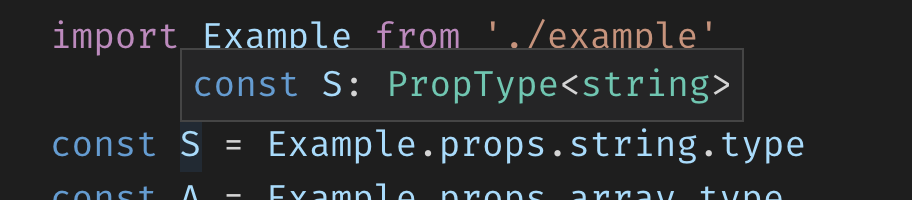

# PropTypes Playground

Open in VS Code, goto `src/demo.ts`, hover over one of identifiers (`S`, `A`, `U`, `O`) defined, VS Code will show type info:

The typescript language server infers type info from PropTypes API and its TS definitions.
